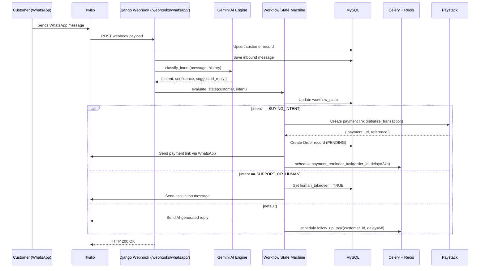
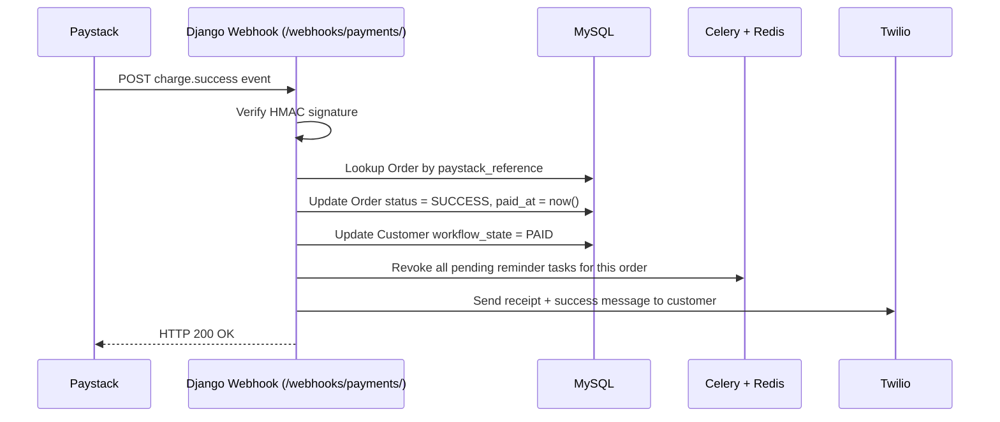
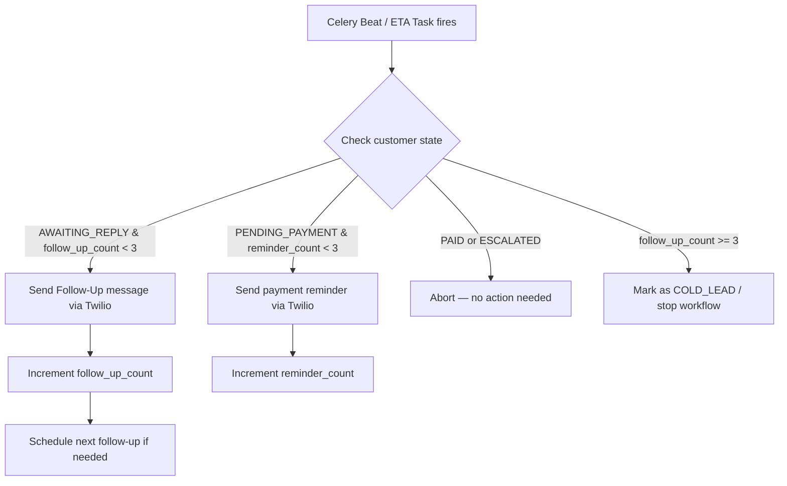

# Implementation Plan: Conversational Commerce AI Automation MVP

**Version:** 1.0  
**Date:** 2026-06-11  
**Stack:** Django 5.2 + DRF · MySQL 8.0 · Redis 7 + Celery 5 · Google Gemini API · Twilio WhatsApp · Paystack  

---

## Table of Contents

1. [Project Overview](#1-project-overview)
2. [Tech Stack Summary](#2-tech-stack-summary)
3. [Folder Structure](#3-folder-structure)
4. [Database Schema (MySQL 8.0)](#4-database-schema-mysql-80)
5. [System Architecture & Data Flow](#5-system-architecture--data-flow)
6. [Module-by-Module Implementation](#6-module-by-module-implementation)
7. [API Endpoints Reference](#7-api-endpoints-reference)
8. [Celery Task Design](#8-celery-task-design)
9. [Environment Variables](#9-environment-variables)
10. [Development Phases & Milestones](#10-development-phases--milestones)
11. [Testing Strategy](#11-testing-strategy)
12. [Deployment Notes](#12-deployment-notes)

---

## 1. Project Overview

An AI-powered WhatsApp sales assistant that automates the full customer journey — from first contact to confirmed payment — for the Nigerian market. The system uses:

- **WhatsApp** (Twilio) as the primary customer touchpoint
- **Google Gemini** to classify intent and generate contextual replies
- **Paystack** to dynamically generate checkout links sent over WhatsApp
- **Celery + Redis** to fire time-delayed follow-up messages automatically
- **Django Admin + custom dashboard** as the minimalist admin panel

---

## 2. Tech Stack Summary

| Layer | Technology | Purpose |
|---|---|---|
| Backend Framework | Django 5.2 + DRF | API server, ORM, admin |
| Database | MySQL 8.0 | Persistent relational storage |
| Cache / Broker | Redis 7 | Celery message broker + session/cache |
| Task Queue | Celery 5 | Async/delayed job execution |
| LLM | Google Gemini API (`gemini-1.5-flash`) | Intent classification + reply generation |
| Messaging | Twilio WhatsApp Business API | Send/receive WhatsApp messages |
| Payments | Paystack API | Dynamic payment link generation + webhooks |
| Web Server | Gunicorn + Nginx | Production serving |
| Env Management | python-decouple / .env | Config isolation |

---

## 3. Folder Structure

```
ai_sales_assistant/
├── manage.py
├── requirements.txt
├── .env
├── .env.example
│
├── config/                         # Django project config
│   ├── __init__.py
│   ├── settings/
│   │   ├── base.py
│   │   ├── development.py
│   │   └── production.py
│   ├── urls.py
│   ├── wsgi.py
│   └── celery.py                   # Celery app init
│
├── apps/
│   ├── customers/                  # Customer profiles & workflow state
│   │   ├── models.py
│   │   ├── serializers.py
│   │   ├── views.py
│   │   └── admin.py
│   │
│   ├── conversations/              # Messages + intent tracking
│   │   ├── models.py
│   │   ├── serializers.py
│   │   ├── views.py
│   │   └── admin.py
│   │
│   ├── payments/                   # Paystack integration + orders
│   │   ├── models.py
│   │   ├── serializers.py
│   │   ├── views.py                # /webhooks/payments/ endpoint
│   │   ├── paystack.py             # Paystack API client
│   │   └── admin.py
│   │
│   ├── messaging/                  # Twilio WhatsApp sender
│   │   ├── twilio_client.py
│   │   └── templates.py            # Message template strings
│   │
│   ├── ai_engine/                  # Gemini integration
│   │   ├── gemini_client.py        # Gemini API wrapper
│   │   ├── intent_classifier.py    # Intent detection logic
│   │   └── reply_generator.py      # AI response builder
│   │
│   ├── workflows/                  # State machine + Celery tasks
│   │   ├── state_machine.py        # WorkflowEngine class
│   │   ├── tasks.py                # Celery tasks (follow-ups, reminders)
│   │   └── scheduler.py            # Task scheduling helpers
│   │
│   └── dashboard/                  # Admin dashboard views
│       ├── views.py
│       ├── urls.py
│       └── templates/
│           └── dashboard/
│               ├── base.html
│               ├── conversations.html
│               ├── payments.html
│               └── settings.html
│
└── static/
    └── dashboard/
        ├── css/
        └── js/
```

---

## 4. Database Schema (MySQL 8.0)

### 4.1 Customers Table

```sql
CREATE TABLE customers (
    id              BIGINT UNSIGNED AUTO_INCREMENT PRIMARY KEY,
    phone_number    VARCHAR(20)  NOT NULL UNIQUE,        -- E.164 format: +2348012345678
    name            VARCHAR(120) DEFAULT NULL,
    email           VARCHAR(254) DEFAULT NULL,
    -- Workflow state machine
    workflow_state  ENUM(
                        'NEW_LEAD',
                        'AWAITING_REPLY',
                        'INTERESTED',
                        'PENDING_PAYMENT',
                        'PAID',
                        'ESCALATED'
                    ) NOT NULL DEFAULT 'NEW_LEAD',
    -- Human takeover flag
    human_takeover  TINYINT(1)   NOT NULL DEFAULT 0,
    takeover_by     VARCHAR(120) DEFAULT NULL,           -- admin username who took over
    -- Follow-up tracking
    follow_up_count TINYINT UNSIGNED NOT NULL DEFAULT 0,
    last_message_at DATETIME     DEFAULT NULL,
    -- Metadata
    source          ENUM('WHATSAPP', 'WEB_FORM') NOT NULL DEFAULT 'WHATSAPP',
    extra_data      JSON         DEFAULT NULL,           -- flexible metadata
    created_at      DATETIME     NOT NULL DEFAULT CURRENT_TIMESTAMP,
    updated_at      DATETIME     NOT NULL DEFAULT CURRENT_TIMESTAMP ON UPDATE CURRENT_TIMESTAMP,

    INDEX idx_workflow_state  (workflow_state),
    INDEX idx_last_message_at (last_message_at),
    INDEX idx_human_takeover  (human_takeover)
) ENGINE=InnoDB DEFAULT CHARSET=utf8mb4 COLLATE=utf8mb4_unicode_ci;
```

### 4.2 Conversations (Messages) Table

```sql
CREATE TABLE messages (
    id              BIGINT UNSIGNED AUTO_INCREMENT PRIMARY KEY,
    customer_id     BIGINT UNSIGNED NOT NULL,
    -- Message content
    body            TEXT         NOT NULL,
    media_url       VARCHAR(512) DEFAULT NULL,           -- image/receipt URLs
    -- Direction & sender
    direction       ENUM('INBOUND', 'OUTBOUND') NOT NULL,
    sender_type     ENUM('USER', 'BOT', 'ADMIN') NOT NULL,
    -- AI classification
    detected_intent ENUM(
                        'GREETING',
                        'PRODUCT_INQUIRY',
                        'BUYING_INTENT',
                        'OBJECTION',
                        'SUPPORT_OR_HUMAN',
                        'UNKNOWN'
                    ) DEFAULT NULL,
    intent_confidence DECIMAL(4,3) DEFAULT NULL,        -- 0.000 to 1.000
    -- Twilio tracking
    twilio_sid      VARCHAR(64)  DEFAULT NULL,
    -- Timestamps
    created_at      DATETIME     NOT NULL DEFAULT CURRENT_TIMESTAMP,

    FOREIGN KEY (customer_id) REFERENCES customers(id) ON DELETE CASCADE,
    INDEX idx_customer_id  (customer_id),
    INDEX idx_direction    (direction),
    INDEX idx_created_at   (created_at),
    INDEX idx_intent       (detected_intent)
) ENGINE=InnoDB DEFAULT CHARSET=utf8mb4 COLLATE=utf8mb4_unicode_ci;
```

### 4.3 Orders / Transactions Table

```sql
CREATE TABLE orders (
    id                  BIGINT UNSIGNED AUTO_INCREMENT PRIMARY KEY,
    customer_id         BIGINT UNSIGNED NOT NULL,
    -- Amounts (stored in kobo/lowest currency unit)
    amount_kobo         INT UNSIGNED NOT NULL,           -- e.g. 5000000 = ₦50,000
    currency            CHAR(3)      NOT NULL DEFAULT 'NGN',
    -- Paystack references
    paystack_reference  VARCHAR(100) NOT NULL UNIQUE,    -- our generated ref
    paystack_access_code VARCHAR(100) DEFAULT NULL,
    payment_url         VARCHAR(512) DEFAULT NULL,       -- checkout URL sent to customer
    -- Status
    status              ENUM(
                            'PENDING',
                            'SUCCESS',
                            'FAILED',
                            'ABANDONED'
                        ) NOT NULL DEFAULT 'PENDING',
    -- Paystack webhook payload (raw, for audit)
    gateway_response    JSON         DEFAULT NULL,
    -- Reminder tracking
    reminder_count      TINYINT UNSIGNED NOT NULL DEFAULT 0,
    last_reminder_at    DATETIME     DEFAULT NULL,
    paid_at             DATETIME     DEFAULT NULL,
    -- Timestamps
    created_at          DATETIME     NOT NULL DEFAULT CURRENT_TIMESTAMP,
    updated_at          DATETIME     NOT NULL DEFAULT CURRENT_TIMESTAMP ON UPDATE CURRENT_TIMESTAMP,

    FOREIGN KEY (customer_id) REFERENCES customers(id) ON DELETE RESTRICT,
    INDEX idx_customer_id        (customer_id),
    INDEX idx_status             (status),
    INDEX idx_paystack_reference (paystack_reference),
    INDEX idx_created_at         (created_at)
) ENGINE=InnoDB DEFAULT CHARSET=utf8mb4 COLLATE=utf8mb4_unicode_ci;
```

### 4.4 Business Settings Table

```sql
CREATE TABLE business_settings (
    id              INT UNSIGNED AUTO_INCREMENT PRIMARY KEY,
    setting_key     VARCHAR(80)  NOT NULL UNIQUE,
    setting_value   TEXT         NOT NULL,
    description     VARCHAR(255) DEFAULT NULL,
    updated_at      DATETIME     NOT NULL DEFAULT CURRENT_TIMESTAMP ON UPDATE CURRENT_TIMESTAMP
) ENGINE=InnoDB DEFAULT CHARSET=utf8mb4 COLLATE=utf8mb4_unicode_ci;

-- Seed default settings
INSERT INTO business_settings (setting_key, setting_value, description) VALUES
  ('business_name',    'My Business',        'Business display name used in messages'),
  ('support_phone',    '+2348000000000',      'Human support WhatsApp number'),
  ('product_catalog',  '{}',                  'JSON blob of product names + prices'),
  ('ai_base_prompt',   'You are a helpful Nigerian sales assistant...', 'Base LLM system prompt');
```

---

## 5. System Architecture & Data Flow

### 5.1 Inbound WhatsApp Message Flow



### 5.2 Payment Webhook Flow



### 5.3 Celery Follow-Up Flow



---

## 6. Module-by-Module Implementation

### Module 1 — Messaging Layer (Twilio)

**File:** `apps/messaging/twilio_client.py`

```python
from twilio.rest import Client
from django.conf import settings

class TwilioWhatsAppClient:
    def __init__(self):
        self.client = Client(settings.TWILIO_ACCOUNT_SID, settings.TWILIO_AUTH_TOKEN)
        self.from_number = f"whatsapp:{settings.TWILIO_WHATSAPP_NUMBER}"

    def send_message(self, to_phone: str, body: str, media_url: str = None) -> str:
        """Send a WhatsApp message. Returns Twilio SID."""
        kwargs = {
            "from_": self.from_number,
            "to": f"whatsapp:{to_phone}",
            "body": body,
        }
        if media_url:
            kwargs["media_url"] = [media_url]
        message = self.client.messages.create(**kwargs)
        return message.sid
```

**Webhook handler:** `apps/conversations/views.py`

```python
from rest_framework.views import APIView
from rest_framework.response import Response
from apps.customers.models import Customer
from apps.conversations.models import Message
from apps.ai_engine.intent_classifier import classify_intent
from apps.workflows.state_machine import WorkflowEngine

class WhatsAppWebhookView(APIView):
    permission_classes = []  # Twilio handles auth via signature validation

    def post(self, request):
        data = request.data
        phone    = data.get("From", "").replace("whatsapp:", "")
        body     = data.get("Body", "").strip()
        media    = data.get("MediaUrl0")

        # 1. Upsert customer
        customer, created = Customer.objects.get_or_create(
            phone_number=phone,
            defaults={"workflow_state": "NEW_LEAD"}
        )

        # 2. Save inbound message
        msg = Message.objects.create(
            customer=customer,
            body=body,
            media_url=media,
            direction="INBOUND",
            sender_type="USER",
        )

        # 3. Skip AI if human has taken over
        if customer.human_takeover:
            return Response(status=200)

        # 4. Classify intent via Gemini
        history = list(customer.messages.order_by("-created_at")[:10].values("body", "sender_type"))
        result  = classify_intent(body, history)
        msg.detected_intent     = result["intent"]
        msg.intent_confidence   = result["confidence"]
        msg.save(update_fields=["detected_intent", "intent_confidence"])

        # 5. Run workflow engine
        engine = WorkflowEngine(customer)
        engine.process(intent=result["intent"], suggested_reply=result["reply"])

        return Response(status=200)
```

---

### Module 2 — AI Engine (Gemini)

**File:** `apps/ai_engine/intent_classifier.py`

```python
import json
import google.generativeai as genai
from django.conf import settings

genai.configure(api_key=settings.GEMINI_API_KEY)
model = genai.GenerativeModel("gemini-1.5-flash")

INTENT_SYSTEM_PROMPT = """
You are an AI sales assistant for a Nigerian business.
Analyze the customer's latest message in context of the conversation history.
Return a JSON object with exactly these keys:
  - intent: one of [GREETING, PRODUCT_INQUIRY, BUYING_INTENT, OBJECTION, SUPPORT_OR_HUMAN, UNKNOWN]
  - confidence: float 0.0 to 1.0
  - reply: a short, friendly, Nigerian-market-appropriate response in plain text (no markdown)
  - product_interest: name of product mentioned, or null
"""

def classify_intent(message: str, history: list) -> dict:
    history_text = "\n".join(
        [f"{'Customer' if m['sender_type'] == 'USER' else 'Assistant'}: {m['body']}" for m in reversed(history)]
    )
    prompt = f"{INTENT_SYSTEM_PROMPT}\n\nConversation History:\n{history_text}\n\nLatest message: {message}\n\nRespond ONLY with valid JSON."

    response = model.generate_content(prompt)
    raw = response.text.strip().lstrip("```json").rstrip("```").strip()

    try:
        parsed = json.loads(raw)
    except json.JSONDecodeError:
        parsed = {"intent": "UNKNOWN", "confidence": 0.0, "reply": "I'm here to help! What would you like to know?", "product_interest": None}

    return parsed
```

---

### Module 3 — Workflow State Machine

**File:** `apps/workflows/state_machine.py`

```python
from apps.messaging.twilio_client import TwilioWhatsAppClient
from apps.payments.paystack import PaystackClient
from apps.conversations.models import Message
from apps.workflows import tasks
from apps.payments.models import Order
from django.utils import timezone
import uuid

twilio = TwilioWhatsAppClient()
paystack = PaystackClient()

class WorkflowEngine:
    TRANSITIONS = {
        "NEW_LEAD":       ["AWAITING_REPLY", "INTERESTED", "ESCALATED"],
        "AWAITING_REPLY": ["INTERESTED", "ESCALATED", "AWAITING_REPLY"],
        "INTERESTED":     ["PENDING_PAYMENT", "ESCALATED"],
        "PENDING_PAYMENT":["PAID", "ESCALATED"],
        "PAID":           [],
        "ESCALATED":      [],
    }

    def __init__(self, customer):
        self.customer = customer

    def transition_to(self, new_state: str):
        allowed = self.TRANSITIONS.get(self.customer.workflow_state, [])
        if new_state in allowed:
            self.customer.workflow_state = new_state
            self.customer.save(update_fields=["workflow_state", "updated_at"])

    def process(self, intent: str, suggested_reply: str):
        c = self.customer

        if intent == "BUYING_INTENT":
            self._handle_buying_intent(suggested_reply)

        elif intent == "SUPPORT_OR_HUMAN":
            self._escalate()

        elif intent == "GREETING" and c.workflow_state == "NEW_LEAD":
            self._send_introduction(suggested_reply)
            self.transition_to("AWAITING_REPLY")
            tasks.send_follow_up.apply_async(
                args=[c.id], countdown=6 * 3600
            )

        else:
            # Send the AI reply and reset follow-up timer
            sid = twilio.send_message(c.phone_number, suggested_reply)
            self._save_outbound(suggested_reply, sid)
            c.last_message_at = timezone.now()
            c.save(update_fields=["last_message_at"])

    def _handle_buying_intent(self, suggested_reply: str):
        c = self.customer
        # Generate payment link
        ref = f"SALE-{c.id}-{uuid.uuid4().hex[:8].upper()}"
        amount_kobo = self._get_product_price_kobo()
        result = paystack.initialize_transaction(
            email=c.email or f"{c.phone_number}@placeholder.com",
            amount=amount_kobo,
            reference=ref,
            metadata={"customer_phone": c.phone_number, "customer_id": c.id}
        )
        order = Order.objects.create(
            customer=c,
            amount_kobo=amount_kobo,
            paystack_reference=ref,
            paystack_access_code=result.get("access_code"),
            payment_url=result.get("authorization_url"),
            status="PENDING",
        )
        message = (
            f"Great! Here's your secure payment link 👇\n\n"
            f"💳 {order.payment_url}\n\n"
            f"Complete your payment and I'll send your confirmation instantly. 🎉"
        )
        sid = twilio.send_message(c.phone_number, message)
        self._save_outbound(message, sid)
        self.transition_to("PENDING_PAYMENT")
        # Schedule 3 payment reminders × 24h apart
        for i in range(1, 4):
            tasks.send_payment_reminder.apply_async(
                args=[order.id], countdown=i * 24 * 3600
            )

    def _escalate(self):
        c = self.customer
        c.human_takeover = True
        c.workflow_state = "ESCALATED"
        c.save(update_fields=["human_takeover", "workflow_state", "updated_at"])
        twilio.send_message(
            c.phone_number,
            "A human agent will be with you shortly. Thank you for your patience! 🙏"
        )

    def _send_introduction(self, suggested_reply: str):
        from apps.customers.models import BusinessSetting
        name = BusinessSetting.get("business_name", "our store")
        msg = (
            f"Hello! Welcome to {name} 👋\n\n"
            f"{suggested_reply}\n\n"
            f"How can I help you today?"
        )
        sid = twilio.send_message(self.customer.phone_number, msg)
        self._save_outbound(msg, sid)

    def _get_product_price_kobo(self) -> int:
        # TODO: Replace with actual product lookup from BusinessSettings
        return 5_000_00  # Default ₦5,000 in kobo

    def _save_outbound(self, body: str, sid: str):
        Message.objects.create(
            customer=self.customer,
            body=body,
            direction="OUTBOUND",
            sender_type="BOT",
            twilio_sid=sid,
        )
```

---

### Module 4 — Paystack Integration

**File:** `apps/payments/paystack.py`

```python
import hmac
import hashlib
import requests
from django.conf import settings

PAYSTACK_BASE = "https://api.paystack.co"

class PaystackClient:
    def __init__(self):
        self.secret = settings.PAYSTACK_SECRET_KEY
        self.headers = {
            "Authorization": f"Bearer {self.secret}",
            "Content-Type": "application/json",
        }

    def initialize_transaction(self, email: str, amount: int, reference: str, metadata: dict = None) -> dict:
        """Returns dict with authorization_url, access_code, reference."""
        payload = {
            "email": email,
            "amount": amount,          # in kobo
            "reference": reference,
            "callback_url": settings.PAYSTACK_CALLBACK_URL,
            "metadata": metadata or {},
        }
        r = requests.post(f"{PAYSTACK_BASE}/transaction/initialize", json=payload, headers=self.headers)
        r.raise_for_status()
        return r.json()["data"]

    def verify_transaction(self, reference: str) -> dict:
        r = requests.get(f"{PAYSTACK_BASE}/transaction/verify/{reference}", headers=self.headers)
        r.raise_for_status()
        return r.json()["data"]

    @staticmethod
    def verify_webhook_signature(payload_bytes: bytes, signature: str) -> bool:
        secret = settings.PAYSTACK_SECRET_KEY.encode("utf-8")
        computed = hmac.new(secret, payload_bytes, hashlib.sha512).hexdigest()
        return hmac.compare_digest(computed, signature)
```

**Payment Webhook View:** `apps/payments/views.py`

```python
import json
from rest_framework.views import APIView
from rest_framework.response import Response
from apps.payments.models import Order
from apps.payments.paystack import PaystackClient
from apps.messaging.twilio_client import TwilioWhatsAppClient
from django.utils import timezone

twilio = TwilioWhatsAppClient()

class PaystackWebhookView(APIView):
    permission_classes = []

    def post(self, request):
        signature = request.headers.get("x-paystack-signature", "")
        if not PaystackClient.verify_webhook_signature(request.body, signature):
            return Response({"error": "Invalid signature"}, status=401)

        payload = json.loads(request.body)
        event   = payload.get("event")

        if event == "charge.success":
            data = payload["data"]
            ref  = data.get("reference")
            try:
                order = Order.objects.select_related("customer").get(paystack_reference=ref)
            except Order.DoesNotExist:
                return Response(status=200)  # Unknown ref — ignore gracefully

            order.status          = "SUCCESS"
            order.paid_at         = timezone.now()
            order.gateway_response = data
            order.save(update_fields=["status", "paid_at", "gateway_response", "updated_at"])

            customer = order.customer
            customer.workflow_state = "PAID"
            customer.save(update_fields=["workflow_state", "updated_at"])

            # Send receipt
            amount_naira = order.amount_kobo / 100
            receipt_msg = (
                f"✅ Payment Confirmed!\n\n"
                f"Hi {customer.name or 'there'}, we've received your payment of ₦{amount_naira:,.2f}.\n"
                f"Reference: {ref}\n\n"
                f"Thank you for your order! 🎉"
            )
            twilio.send_message(customer.phone_number, receipt_msg)

        return Response(status=200)
```

---

### Module 5 — Celery Tasks

**File:** `apps/workflows/tasks.py`

```python
from celery import shared_task
from django.utils import timezone

@shared_task(bind=True, max_retries=3)
def send_follow_up(self, customer_id: int):
    from apps.customers.models import Customer
    from apps.messaging.twilio_client import TwilioWhatsAppClient
    from apps.conversations.models import Message

    try:
        customer = Customer.objects.get(id=customer_id)
    except Customer.DoesNotExist:
        return

    # Abort if state has changed (customer responded or escalated)
    if customer.workflow_state not in ("AWAITING_REPLY", "NEW_LEAD"):
        return
    if customer.human_takeover:
        return
    if customer.follow_up_count >= 3:
        return

    twilio = TwilioWhatsAppClient()
    messages = [
        "Hi! Just checking in 👋 Did you have any questions about our products? We're here to help!",
        "Hey, still thinking it over? 😊 We'd love to help you find exactly what you need!",
        "Last check-in from us! 🙏 If you'd like to learn more or are ready to order, just reply here.",
    ]
    msg = messages[min(customer.follow_up_count, 2)]
    sid = twilio.send_message(customer.phone_number, msg)

    Message.objects.create(
        customer=customer, body=msg,
        direction="OUTBOUND", sender_type="BOT", twilio_sid=sid
    )
    customer.follow_up_count += 1
    customer.save(update_fields=["follow_up_count", "updated_at"])

    # Schedule next follow-up if needed
    if customer.follow_up_count < 3:
        send_follow_up.apply_async(args=[customer_id], countdown=6 * 3600)


@shared_task(bind=True, max_retries=3)
def send_payment_reminder(self, order_id: int):
    from apps.payments.models import Order
    from apps.messaging.twilio_client import TwilioWhatsAppClient
    from apps.conversations.models import Message

    try:
        order = Order.objects.select_related("customer").get(id=order_id)
    except Order.DoesNotExist:
        return

    if order.status != "PENDING":
        return  # Already paid or failed — abort

    customer = order.customer
    amount_naira = order.amount_kobo / 100
    msg = (
        f"Hi! Just a reminder to complete your payment of ₦{amount_naira:,.2f} 🙏\n\n"
        f"Your payment link is still active:\n{order.payment_url}\n\n"
        f"Need help? Just reply here!"
    )
    twilio = TwilioWhatsAppClient()
    sid = twilio.send_message(customer.phone_number, msg)
    Message.objects.create(
        customer=customer, body=msg,
        direction="OUTBOUND", sender_type="BOT", twilio_sid=sid
    )
    order.reminder_count += 1
    order.last_reminder_at = timezone.now()
    order.save(update_fields=["reminder_count", "last_reminder_at", "updated_at"])
```

---

## 7. API Endpoints Reference

| Method | Path | Description |
|---|---|---|
| POST | `/webhooks/whatsapp/` | Twilio inbound message webhook |
| POST | `/webhooks/payments/` | Paystack charge.success webhook |
| GET  | `/api/customers/` | List all customers (dashboard) |
| GET  | `/api/customers/{id}/` | Customer detail + message history |
| POST | `/api/customers/{id}/takeover/` | Toggle human takeover |
| GET  | `/api/orders/` | Payment ledger |
| GET  | `/api/orders/{id}/` | Order detail |
| GET  | `/api/settings/` | Business settings |
| PUT  | `/api/settings/{key}/` | Update a setting |
| GET  | `/dashboard/` | Admin dashboard (HTML) |
| GET  | `/dashboard/conversations/` | Live chat view |
| GET  | `/dashboard/payments/` | Payment ledger view |
| GET  | `/dashboard/settings/` | Response editor |

---

## 8. Celery Task Design

```python
# config/celery.py
from celery import Celery
import os

os.environ.setdefault("DJANGO_SETTINGS_MODULE", "config.settings.development")

app = Celery("ai_sales_assistant")
app.config_from_object("django.conf:settings", namespace="CELERY")
app.autodiscover_tasks()

# Celery config in settings/base.py
CELERY_BROKER_URL          = "redis://localhost:6379/0"
CELERY_RESULT_BACKEND      = "redis://localhost:6379/1"
CELERY_TASK_SERIALIZER     = "json"
CELERY_RESULT_SERIALIZER   = "json"
CELERY_ACCEPT_CONTENT      = ["json"]
CELERY_TIMEZONE            = "Africa/Lagos"
CELERY_TASK_TRACK_STARTED  = True
CELERY_BEAT_SCHEDULE       = {}   # All tasks are ETA-based, not periodic
```

**Starting workers:**
```bash
# Worker
celery -A config worker --loglevel=info

# Beat (if periodic tasks are added later)
celery -A config beat --loglevel=info
```

---

## 9. Environment Variables

```ini
# .env.example

# Django
SECRET_KEY=your-django-secret-key
DEBUG=True
ALLOWED_HOSTS=localhost,127.0.0.1

# Database
DB_NAME=ai_sales_db
DB_USER=root
DB_PASSWORD=yourpassword
DB_HOST=localhost
DB_PORT=3306

# Redis
REDIS_URL=redis://localhost:6379/0

# Twilio
TWILIO_ACCOUNT_SID=ACxxxxxxxxxxxxxxxxxxxxxxxxxxxxxxxx
TWILIO_AUTH_TOKEN=your_twilio_auth_token
TWILIO_WHATSAPP_NUMBER=+14155238886

# Google Gemini
GEMINI_API_KEY=your_gemini_api_key

# Paystack
PAYSTACK_SECRET_KEY=sk_live_xxxxxxxxxxxxxxxxxxxx
PAYSTACK_CALLBACK_URL=https://yourdomain.com/webhooks/payments/
```

---

## 10. Development Phases & Milestones

### Phase 1 — Foundation (Week 1)
- [ ] Django project scaffold with `config/settings/` split
- [ ] MySQL database setup + Django models (Customer, Message, Order, BusinessSetting)
- [ ] Run `makemigrations` + `migrate`
- [ ] Redis + Celery worker running
- [ ] `.env` loading via `python-decouple`
- [ ] Django Admin registered for all models

### Phase 2 — Core Integrations (Week 2)
- [ ] Twilio WhatsApp webhook endpoint (inbound message handler)
- [ ] Twilio message sender (`TwilioWhatsAppClient`)
- [ ] Google Gemini intent classifier (`classify_intent`)
- [ ] Paystack client (`initialize_transaction`, `verify_webhook_signature`)
- [ ] Paystack webhook endpoint (`charge.success` handler)

### Phase 3 — Workflow Engine (Week 3)
- [ ] `WorkflowEngine` state machine
- [ ] Celery tasks: `send_follow_up`, `send_payment_reminder`
- [ ] End-to-end test: message → intent → state → reply → follow-up
- [ ] End-to-end test: buying intent → payment link → webhook → receipt

### Phase 4 — Admin Dashboard (Week 4)
- [ ] DRF API endpoints for customers, orders, settings
- [ ] Live chat HTML view (conversation thread per customer)
- [ ] Human takeover toggle (POST `/api/customers/{id}/takeover/`)
- [ ] Payment ledger table
- [ ] Business settings editor (business name, product catalog, AI prompt)

### Phase 5 — Polish & Deploy (Week 5)
- [ ] Twilio webhook signature validation middleware
- [ ] Error handling + logging (Sentry or Django logging)
- [ ] Rate limiting on webhook endpoints
- [ ] Gunicorn + Nginx configuration
- [ ] MySQL production tuning
- [ ] Final QA with real Twilio sandbox + Paystack test mode

---

## 11. Testing Strategy

| Type | Tool | Coverage |
|---|---|---|
| Unit Tests | `pytest-django` | Models, Paystack client, intent parser |
| Integration | `pytest` + `responses` mock | Twilio webhook handler, Gemini mocked |
| Celery Tests | `celery.contrib.pytest` | Task execution, countdown scheduling |
| End-to-End | Twilio sandbox + Paystack test keys | Full happy path + payment webhook |
| Manual QA | Real WhatsApp (sandbox number) | Conversation flow, follow-up timing |

---

## 12. Deployment Notes

- **Server:** Ubuntu 22.04 on a VPS (DigitalOcean / Railway / Render)
- **Process Manager:** Supervisor or systemd for Gunicorn + Celery worker
- **SSL:** Let's Encrypt (required for Twilio + Paystack webhooks — both need HTTPS)
- **Webhook URL exposure (dev):** Use `ngrok` to expose localhost for Twilio + Paystack testing
- **MySQL:** Use `mysqlclient` Python adapter (not PyMySQL) for best Django compatibility
- **Media files:** Store Twilio media (receipts/images) on S3 or Cloudflare R2

---

*End of Implementation Plan v1.0*
