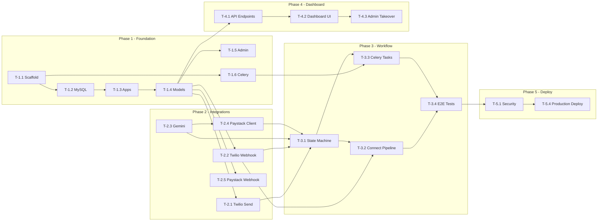

# Task Breakdown: Conversational Commerce AI Automation MVP

**Derived from:** [01_implementation_plan.md](file:///c:/Users/HP/Documents/temitope/AI%20Sales%20&%20Payment%20Assistant%20on%20WhatsApp/plans/01_implementation_plan.md)  
**Last Updated:** 2026-06-11  

---

## Legend

- `[ ]` — Not started  
- `[/]` — In progress  
- `[x]` — Completed  
- 🔗 — Has dependency on another task  
- ⚙️ — Configuration / setup  
- 🧪 — Requires testing  

---

## Phase 1 — Project Foundation (Week 1)

### 1.1 Django Project Scaffold ⚙️
- [ ] **T-1.1.1** — Create Django 5.2 project using `django-admin startproject config .`
- [ ] **T-1.1.2** — Split settings into `config/settings/base.py`, `development.py`, `production.py`
- [ ] **T-1.1.3** — Install and configure `python-decouple` for `.env` loading
- [ ] **T-1.1.4** — Create `.env` and `.env.example` with all required variables
- [ ] **T-1.1.5** — Create `requirements.txt` with all pinned dependencies:
  - Django 5.2, djangorestframework, celery, redis, mysqlclient, twilio, google-generativeai, requests, python-decouple, gunicorn
- [ ] **T-1.1.6** — Add `.gitignore` (Python/Django template)
- [ ] **T-1.1.7** — Verify `python manage.py runserver` starts without errors

> **Acceptance:** Django dev server runs cleanly; settings split works for both `development` and `production`.

---

### 1.2 MySQL Database Setup ⚙️
- [ ] **T-1.2.1** — Configure MySQL 8.0 connection in `settings/base.py` using env vars
- [ ] **T-1.2.2** — Set `charset=utf8mb4` and `collation=utf8mb4_unicode_ci` in DB config
- [ ] **T-1.2.3** — Create the `ai_sales_db` database in MySQL
- [ ] **T-1.2.4** — Verify Django connects to MySQL (`python manage.py dbshell`)

> **Acceptance:** Django can connect and run raw SQL against MySQL 8.0.

---

### 1.3 Django Apps Creation ⚙️
- [ ] **T-1.3.1** — Create app: `apps/customers/`
- [ ] **T-1.3.2** — Create app: `apps/conversations/`
- [ ] **T-1.3.3** — Create app: `apps/payments/`
- [ ] **T-1.3.4** — Create app: `apps/messaging/`
- [ ] **T-1.3.5** — Create app: `apps/ai_engine/`
- [ ] **T-1.3.6** — Create app: `apps/workflows/`
- [ ] **T-1.3.7** — Create app: `apps/dashboard/`
- [ ] **T-1.3.8** — Register all apps in `INSTALLED_APPS`
- [ ] **T-1.3.9** — Create `apps/__init__.py`

> **Acceptance:** All 7 apps are created and recognized by Django.

---

### 1.4 Database Models
- [ ] **T-1.4.1** — Create `Customer` model (`apps/customers/models.py`)
  - Fields: phone_number (unique), name, email, workflow_state (CharField with choices), human_takeover, takeover_by, follow_up_count, last_message_at, source, extra_data (JSONField), timestamps
  - Indexes: workflow_state, last_message_at, human_takeover
- [ ] **T-1.4.2** — Create `Message` model (`apps/conversations/models.py`)
  - Fields: customer (FK), body, media_url, direction, sender_type, detected_intent, intent_confidence, twilio_sid, created_at
  - Indexes: customer_id, direction, created_at, detected_intent
- [ ] **T-1.4.3** — Create `Order` model (`apps/payments/models.py`)
  - Fields: customer (FK), amount_kobo, currency, paystack_reference (unique), paystack_access_code, payment_url, status, gateway_response (JSONField), reminder_count, last_reminder_at, paid_at, timestamps
  - Indexes: customer_id, status, paystack_reference, created_at
- [ ] **T-1.4.4** — Create `BusinessSetting` model (`apps/customers/models.py`)
  - Fields: setting_key (unique), setting_value, description, updated_at
  - Class method: `get(key, default)` for easy retrieval
- [ ] **T-1.4.5** — Run `python manage.py makemigrations` — verify all migrations are clean
- [ ] **T-1.4.6** — Run `python manage.py migrate` — apply to MySQL
- [ ] **T-1.4.7** — Create data migration to seed default `BusinessSetting` rows (business_name, support_phone, product_catalog, ai_base_prompt)

> **Acceptance:** All tables created in MySQL. `python manage.py showmigrations` shows all applied. 🧪

---

### 1.5 Django Admin Registration
- [ ] **T-1.5.1** — Register `Customer` in admin with list_display, list_filter, search_fields
- [ ] **T-1.5.2** — Register `Message` in admin with list_display, list_filter (customer, intent, direction)
- [ ] **T-1.5.3** — Register `Order` in admin with list_display, list_filter (status, created_at)
- [ ] **T-1.5.4** — Register `BusinessSetting` in admin
- [ ] **T-1.5.5** — Create superuser (`python manage.py createsuperuser`)
- [ ] **T-1.5.6** — Verify admin panel at `/admin/` displays all models correctly

> **Acceptance:** Admin panel functional with all models browsable and editable.

---

### 1.6 Redis + Celery Setup ⚙️
- [ ] **T-1.6.1** — Install and verify Redis 7 is running locally
- [ ] **T-1.6.2** — Create `config/celery.py` — Celery app initialization
- [ ] **T-1.6.3** — Update `config/__init__.py` to auto-load Celery app
- [ ] **T-1.6.4** — Add Celery config to `settings/base.py` (broker URL, result backend, timezone `Africa/Lagos`, serializer)
- [ ] **T-1.6.5** — Create a dummy test task and verify it executes via `celery -A config worker`
- [ ] **T-1.6.6** — Verify task appears in Redis (`redis-cli KEYS *`)

> **Acceptance:** Celery worker starts, picks up and executes a test task, result stored in Redis. 🧪

---

## Phase 2 — Core Integrations (Week 2)

### 2.1 Twilio WhatsApp — Sending Messages
- [ ] **T-2.1.1** — Create `apps/messaging/twilio_client.py` — `TwilioWhatsAppClient` class
  - `send_message(to_phone, body, media_url=None) -> str` — returns Twilio SID
- [ ] **T-2.1.2** — Add Twilio credentials to `.env` (ACCOUNT_SID, AUTH_TOKEN, WHATSAPP_NUMBER)
- [ ] **T-2.1.3** — Add Twilio settings to `settings/base.py`
- [ ] **T-2.1.4** — Create `apps/messaging/templates.py` — reusable message template strings (intro, follow-up, payment link, receipt)
- [ ] **T-2.1.5** 🧪 — Write unit test: mock Twilio client, verify `send_message` formats correctly

> **Acceptance:** `TwilioWhatsAppClient.send_message()` sends a message to Twilio sandbox successfully.

---

### 2.2 Twilio WhatsApp — Receiving Messages (Webhook)
- [ ] **T-2.2.1** — Create `WhatsAppWebhookView` in `apps/conversations/views.py` (DRF APIView, no auth)
  - Parse Twilio payload: From, Body, MediaUrl0, MessageSid
  - Upsert customer
  - Save inbound message
  - Check `human_takeover` — skip AI if True
  - Call intent classifier (stubbed initially)
  - Call workflow engine (stubbed initially)
  - Return HTTP 200
- [ ] **T-2.2.2** — Wire URL: `POST /webhooks/whatsapp/` → `WhatsAppWebhookView`
- [ ] **T-2.2.3** — Disable CSRF for webhook endpoint (exempt or DRF handles it)
- [ ] **T-2.2.4** 🧪 — Write integration test: POST mock Twilio payload → verify customer created + message saved
- [ ] **T-2.2.5** — (Dev) Install `ngrok`, expose localhost, configure Twilio sandbox webhook URL

> **Acceptance:** Sending a WhatsApp message to the Twilio sandbox number creates a customer and message record in MySQL. 🧪

---

### 2.3 Google Gemini — Intent Classification 🔗
*Depends on: T-2.2.1 (webhook needs to call this)*

- [ ] **T-2.3.1** — Create `apps/ai_engine/gemini_client.py` — configure Gemini API key, initialize model (`gemini-1.5-flash`)
- [ ] **T-2.3.2** — Create `apps/ai_engine/intent_classifier.py` — `classify_intent(message, history) -> dict`
  - System prompt enforcing JSON output with: intent, confidence, reply, product_interest
  - Parse JSON response with fallback for malformed output
  - Supported intents: GREETING, PRODUCT_INQUIRY, BUYING_INTENT, OBJECTION, SUPPORT_OR_HUMAN, UNKNOWN
- [ ] **T-2.3.3** — Create `apps/ai_engine/reply_generator.py` — reserved for future use (advanced reply customization)
- [ ] **T-2.3.4** — Add `GEMINI_API_KEY` to `.env` and settings
- [ ] **T-2.3.5** 🧪 — Write unit test: mock Gemini response, verify intent parsing and fallback behavior
- [ ] **T-2.3.6** 🧪 — Manual test: send real messages, inspect classified intents in DB

> **Acceptance:** Given a customer message + history, returns structured `{intent, confidence, reply}`. Handles Gemini API errors gracefully.

---

### 2.4 Paystack — Payment Link Generation 🔗
*Depends on: nothing (can be built in parallel)*

- [ ] **T-2.4.1** — Create `apps/payments/paystack.py` — `PaystackClient` class
  - `initialize_transaction(email, amount, reference, metadata) -> dict` — returns `{authorization_url, access_code, reference}`
  - `verify_transaction(reference) -> dict`
  - `verify_webhook_signature(payload_bytes, signature) -> bool` — HMAC-SHA512 check
- [ ] **T-2.4.2** — Add `PAYSTACK_SECRET_KEY` and `PAYSTACK_CALLBACK_URL` to `.env` and settings
- [ ] **T-2.4.3** 🧪 — Write unit test: mock Paystack API, verify transaction initialization
- [ ] **T-2.4.4** 🧪 — Integration test with Paystack test keys: create a real test transaction, get a real URL

> **Acceptance:** `PaystackClient.initialize_transaction()` returns a valid checkout URL using Paystack test keys.

---

### 2.5 Paystack — Payment Webhook 🔗
*Depends on: T-2.4.1 (PaystackClient), T-1.4.3 (Order model)*

- [ ] **T-2.5.1** — Create `PaystackWebhookView` in `apps/payments/views.py` (DRF APIView, no auth)
  - Verify HMAC signature from `x-paystack-signature` header
  - Handle `charge.success` event:
    - Lookup Order by `paystack_reference`
    - Update Order: status=SUCCESS, paid_at=now(), gateway_response=payload
    - Update Customer: workflow_state=PAID
    - Send receipt message via Twilio
  - Return HTTP 200
- [ ] **T-2.5.2** — Wire URL: `POST /webhooks/payments/` → `PaystackWebhookView`
- [ ] **T-2.5.3** 🧪 — Write integration test: mock Paystack webhook payload with valid signature → verify order updated + customer state changed
- [ ] **T-2.5.4** 🧪 — Write test: invalid signature → returns 401

> **Acceptance:** Receiving a `charge.success` webhook updates the order to SUCCESS and the customer to PAID, then sends a WhatsApp receipt. 🧪

---

## Phase 3 — Workflow Engine (Week 3)

### 3.1 State Machine 🔗
*Depends on: T-2.1.1 (Twilio), T-2.3.2 (Gemini), T-2.4.1 (Paystack)*

- [ ] **T-3.1.1** — Create `apps/workflows/state_machine.py` — `WorkflowEngine` class
  - Constructor takes a `Customer` instance
  - `TRANSITIONS` dict defining valid state movements
  - `transition_to(new_state)` — validates and persists state change
  - `process(intent, suggested_reply)` — main dispatcher:
    - BUYING_INTENT → generate payment link, create Order, send link, schedule reminders
    - SUPPORT_OR_HUMAN → set human_takeover=True, escalate
    - GREETING (NEW_LEAD) → send intro, move to AWAITING_REPLY, schedule follow-up
    - Default → send AI reply, update last_message_at
  - `_handle_buying_intent()` — calls Paystack, creates Order, sends WhatsApp message with payment link
  - `_escalate()` — flags customer, sends escalation message
  - `_send_introduction()` — reads business_name from settings, sends welcome
  - `_get_product_price_kobo()` — reads from BusinessSettings (placeholder initially)
  - `_save_outbound()` — saves bot message to DB
- [ ] **T-3.1.2** 🧪 — Unit test: verify valid/invalid state transitions
- [ ] **T-3.1.3** 🧪 — Unit test: BUYING_INTENT triggers payment link generation
- [ ] **T-3.1.4** 🧪 — Unit test: SUPPORT_OR_HUMAN sets human_takeover flag

> **Acceptance:** WorkflowEngine correctly transitions states, generates payment links for buyers, and escalates support requests.

---

### 3.2 Connect Webhook → AI → Workflow 🔗
*Depends on: T-2.2.1, T-2.3.2, T-3.1.1*

- [ ] **T-3.2.1** — Update `WhatsAppWebhookView` to call `classify_intent()` with real Gemini
- [ ] **T-3.2.2** — Update `WhatsAppWebhookView` to instantiate `WorkflowEngine` and call `process()`
- [ ] **T-3.2.3** — Save `detected_intent` and `intent_confidence` on the Message record
- [ ] **T-3.2.4** 🧪 — End-to-end test (mocked): inbound message → intent classified → state updated → outbound message sent

> **Acceptance:** A single inbound WhatsApp message flows through the entire pipeline: webhook → Gemini → state machine → Twilio response.

---

### 3.3 Celery Tasks — Follow-Ups & Reminders 🔗
*Depends on: T-1.6.2 (Celery), T-2.1.1 (Twilio), T-3.1.1 (state machine)*

- [ ] **T-3.3.1** — Create `apps/workflows/tasks.py` — `send_follow_up` task
  - Accepts `customer_id`
  - Checks: state is AWAITING_REPLY/NEW_LEAD, not human_takeover, follow_up_count < 3
  - Sends progressive follow-up messages (3 variants)
  - Increments `follow_up_count`
  - Schedules next follow-up if count < 3
- [ ] **T-3.3.2** — Create `send_payment_reminder` task
  - Accepts `order_id`
  - Checks: order status is PENDING, reminder_count < 3
  - Sends payment reminder with link
  - Increments `reminder_count`
- [ ] **T-3.3.3** — Wire tasks into `WorkflowEngine.process()`:
  - GREETING → schedule `send_follow_up` with 6h countdown
  - BUYING_INTENT → schedule 3 × `send_payment_reminder` at 24h, 48h, 72h
- [ ] **T-3.3.4** 🧪 — Unit test: follow-up aborts if customer already replied (state changed)
- [ ] **T-3.3.5** 🧪 — Unit test: payment reminder aborts if order is already SUCCESS
- [ ] **T-3.3.6** 🧪 — Unit test: follow-up stops after 3 attempts

> **Acceptance:** Celery tasks fire on schedule, send appropriate messages, and self-cancel when state changes. 🧪

---

### 3.4 End-to-End Flow Testing 🧪
*Depends on: all Phase 3 tasks*

- [ ] **T-3.4.1** — E2E test: Happy path — new customer sends greeting → gets intro → sends buying intent → gets payment link → Paystack webhook fires → receipt sent
- [ ] **T-3.4.2** — E2E test: Follow-up path — new customer sends greeting → no reply for 6h → follow-up #1 fires
- [ ] **T-3.4.3** — E2E test: Escalation path — customer sends "I need to talk to a human" → human_takeover set → AI stops replying
- [ ] **T-3.4.4** — E2E test: Payment reminder stops after payment — customer pays → all pending reminders are no-ops

> **Acceptance:** All 4 core user flows work end-to-end with mocked external services.

---

## Phase 4 — Admin Dashboard (Week 4)

### 4.1 DRF API Endpoints 🔗
*Depends on: T-1.4.x (models)*

- [ ] **T-4.1.1** — Create `apps/customers/serializers.py` — CustomerSerializer (list + detail)
- [ ] **T-4.1.2** — Create `apps/customers/views.py` — CustomerViewSet (list, retrieve)
  - Include nested recent messages in detail view
- [ ] **T-4.1.3** — Create `POST /api/customers/{id}/takeover/` — toggle `human_takeover` flag
- [ ] **T-4.1.4** — Create `apps/payments/serializers.py` — OrderSerializer
- [ ] **T-4.1.5** — Create `apps/payments/views.py` — OrderViewSet (list, retrieve) — payment ledger API
- [ ] **T-4.1.6** — Create `apps/customers/views.py` — BusinessSettingViewSet (list, update)
- [ ] **T-4.1.7** — Wire all API URLs under `/api/` in `config/urls.py`
- [ ] **T-4.1.8** — Add DRF authentication (SessionAuth + TokenAuth for API access)
- [ ] **T-4.1.9** 🧪 — Test all API endpoints return correct data

> **Acceptance:** All `/api/` endpoints return correct JSON data with proper auth. Browsable DRF API works.

---

### 4.2 Dashboard — HTML Templates 🔗
*Depends on: T-4.1.x (API endpoints)*

- [ ] **T-4.2.1** — Create `apps/dashboard/templates/dashboard/base.html` — base layout with navigation sidebar
  - Modern dark theme with glassmorphism aesthetics
  - Responsive sidebar: Conversations | Payments | Settings
  - Google Font (Inter or Outfit)
- [ ] **T-4.2.2** — Create `static/dashboard/css/dashboard.css` — design system (colors, typography, cards, tables)
- [ ] **T-4.2.3** — Create `apps/dashboard/templates/dashboard/conversations.html` — Live Chat View
  - Left panel: list of customers with state badge (color-coded)
  - Right panel: message thread for selected customer
  - "Take Over" / "Release" button
  - Auto-refresh or polling for new messages
- [ ] **T-4.2.4** — Create `apps/dashboard/templates/dashboard/payments.html` — Payment Ledger
  - Data table: Customer Name/Phone, Amount (₦), Status (badge), Reference, Date
  - Filter by status (Pending/Success/Failed)
  - Search by phone or reference
- [ ] **T-4.2.5** — Create `apps/dashboard/templates/dashboard/settings.html` — Response Editor
  - Editable fields: business_name, support_phone, product_catalog (JSON editor), ai_base_prompt (textarea)
  - Save button per setting or bulk save
- [ ] **T-4.2.6** — Create `apps/dashboard/views.py` — Django views serving the HTML templates
- [ ] **T-4.2.7** — Create `apps/dashboard/urls.py` — wire `/dashboard/`, `/dashboard/conversations/`, `/dashboard/payments/`, `/dashboard/settings/`
- [ ] **T-4.2.8** — Add `static/dashboard/js/dashboard.js` — fetch logic for API calls, DOM manipulation

> **Acceptance:** Dashboard is accessible at `/dashboard/`, shows real data, and the takeover button works.

---

### 4.3 Admin Message Sending (Takeover) 🔗
*Depends on: T-4.2.3 (conversations view), T-2.1.1 (Twilio)*

- [ ] **T-4.3.1** — Add "Send Message" input in conversations view (text box + send button)
- [ ] **T-4.3.2** — Create API endpoint: `POST /api/customers/{id}/send-message/` — sends message as ADMIN via Twilio
- [ ] **T-4.3.3** — Save admin messages with `sender_type=ADMIN`
- [ ] **T-4.3.4** — When takeover is released, resume AI processing

> **Acceptance:** Admin can take over a conversation, send manual replies, and release back to AI.

---

## Phase 5 — Security, Polish & Deploy (Week 5)

### 5.1 Webhook Security
- [ ] **T-5.1.1** — Add Twilio webhook signature validation middleware (`twilio.request_validator`)
- [ ] **T-5.1.2** — Verify Paystack HMAC validation is working in production mode
- [ ] **T-5.1.3** — Add rate limiting to webhook endpoints (django-ratelimit or DRF throttling)
- [ ] **T-5.1.4** — Ensure webhook endpoints reject non-POST methods

> **Acceptance:** Invalid signatures are rejected with 401/403. Rate limits prevent abuse.

---

### 5.2 Error Handling & Logging
- [ ] **T-5.2.1** — Configure Django logging (file + console) with structured format
- [ ] **T-5.2.2** — Add try/except with logging around Gemini API calls (graceful degradation)
- [ ] **T-5.2.3** — Add try/except with logging around Twilio API calls
- [ ] **T-5.2.4** — Add try/except with logging around Paystack API calls
- [ ] **T-5.2.5** — Add Celery task error handling with `max_retries=3` and exponential backoff
- [ ] **T-5.2.6** — Optional: integrate Sentry for error tracking

> **Acceptance:** All external API calls are wrapped with error handling. Failed tasks retry up to 3 times. Errors are logged with full context.

---

### 5.3 Web Landing Page (Lead Capture Form) 🔗
*Depends on: T-3.1.1 (workflow engine)*

- [ ] **T-5.3.1** — Create a simple, responsive landing page at `/` with lead capture form
  - Fields: Name, Phone (Nigerian format), Email (optional), Message
  - Beautiful design consistent with dashboard theme
- [ ] **T-5.3.2** — Create API endpoint: `POST /api/leads/` — processes web form submission
  - Upsert customer with `source=WEB_FORM`
  - Save message
  - Trigger workflow engine (same as WhatsApp flow)
- [ ] **T-5.3.3** — Send first WhatsApp message to the lead after form submission
- [ ] **T-5.3.4** 🧪 — Test: form submission creates customer + triggers WhatsApp intro message

> **Acceptance:** Submitting the web form creates a lead and triggers the same automated WhatsApp workflow.

---

### 5.4 Production Deployment ⚙️
- [ ] **T-5.4.1** — Configure `production.py` settings (DEBUG=False, ALLOWED_HOSTS, SECURE_* flags)
- [ ] **T-5.4.2** — Set up Gunicorn with appropriate workers configuration
- [ ] **T-5.4.3** — Set up Nginx as reverse proxy (+ serve static files)
- [ ] **T-5.4.4** — Configure SSL via Let's Encrypt (required for Twilio + Paystack)
- [ ] **T-5.4.5** — Set up Supervisor/systemd for: Gunicorn, Celery worker, Celery beat
- [ ] **T-5.4.6** — Configure MySQL production settings (connection pooling, slow query log)
- [ ] **T-5.4.7** — Run `python manage.py collectstatic`
- [ ] **T-5.4.8** — Run `python manage.py migrate` on production DB
- [ ] **T-5.4.9** — Set Twilio webhook URL to production domain
- [ ] **T-5.4.10** — Set Paystack webhook URL to production domain
- [ ] **T-5.4.11** — Smoke test: send WhatsApp message → full flow works on production

> **Acceptance:** Application is live on a public HTTPS domain. Full WhatsApp → AI → Payment flow works end-to-end in production.

---

## Task Summary

| Phase | Tasks | Description |
|---|---|---|
| Phase 1 | T-1.1.1 → T-1.6.6 | Project scaffold, DB, models, admin, Celery |
| Phase 2 | T-2.1.1 → T-2.5.4 | Twilio, Gemini, Paystack integrations |
| Phase 3 | T-3.1.1 → T-3.4.4 | State machine, Celery tasks, E2E flows |
| Phase 4 | T-4.1.1 → T-4.3.4 | API endpoints, dashboard UI, admin takeover |
| Phase 5 | T-5.1.1 → T-5.4.11 | Security, landing page, deployment |

**Total Tasks: 85**

---

## Dependency Graph (Critical Path)

---

*End of Task Breakdown v1.0*
